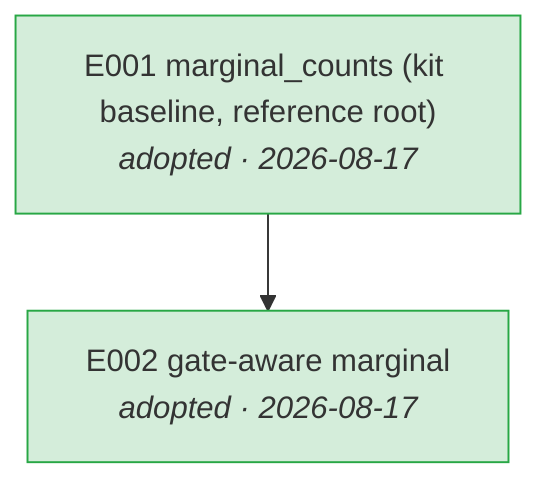

# Experiment tree

Generated by `python scripts/render_tree.py` from `docs/experiments/E*.md` — do not edit by hand.

```mermaid
flowchart TD
    E001["E001 marginal_counts (kit baseline, reference root)<br/><i>adopted · 2026-08-17</i>"]
    E002["E002 gate-aware marginal<br/><i>adopted · 2026-08-17</i>"]
    E001 --> E002
    classDef adopted fill:#d4edda,stroke:#28a745
    class E001,E002 adopted
```
